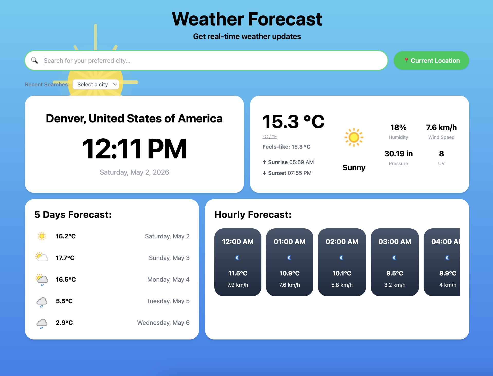
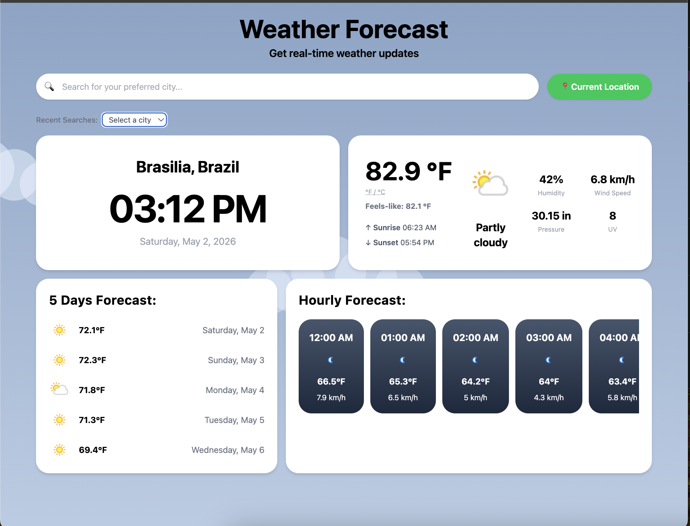
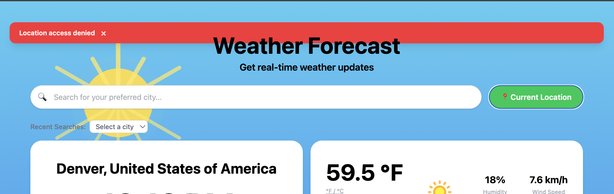
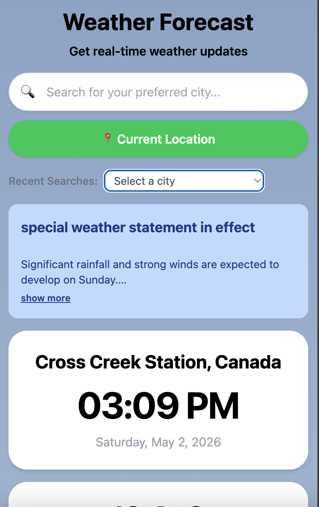
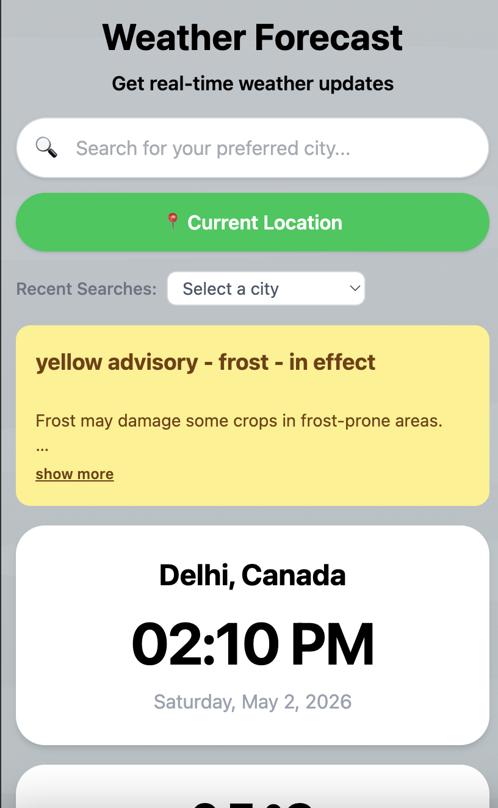
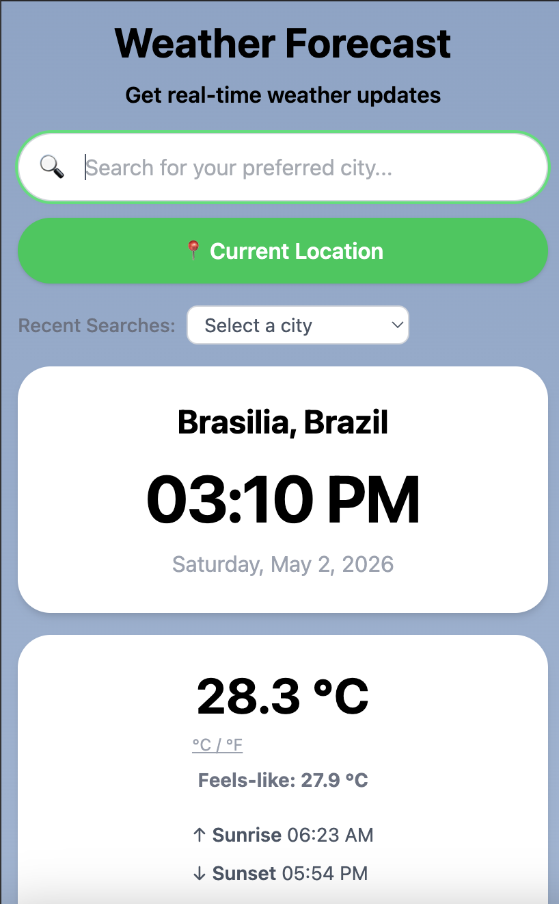

# 🌦 Weather Forecast Application

A responsive and interactive Weather Forecast Application built using **HTML**, **Tailwind CSS**, and **Vanilla JavaScript**.  
This application allows users to search weather forecasts by city name or current location and view current weather conditions along with a 5-day extended forecast.

🔗 **GitHub:** [kittypawgrammer/WeatherApp](https://github.com/kittypawgrammer/WeatherApp)

---

## 🚀 Features

### 🔍 Search Weather by City
- Users can enter a city name to fetch weather details.

### 📍 Current Location Weather
- Uses browser geolocation API to get weather for the user's current location.

### 🌡 Current Weather Display
Displays:
- City Name
- Temperature
- Weather Condition
- Humidity
- Wind Speed

### 📅 5-Day Forecast
Displays weather forecast cards including:
- Date
- Temperature
- Humidity
- Wind Speed
- Weather Icons

### 🕘 Recent Searches Dropdown
- Recently searched cities are stored using **LocalStorage**.
- Clicking a city from dropdown fetches its weather data.

### 🔄 Temperature Unit Toggle
- Toggle today’s temperature between **°C** and **°F**.

### ⚠ Weather Alerts
- Shows alerts for extreme temperatures.

### 🎨 Dynamic UI
- Animated SVG weather scenes render based on current conditions (rain streaks, falling snow, twinkling stars, lightning, drifting clouds, fog, wind lines, sun rays).
- Gradient background layer pairs with each scene for 9 distinct weather states: Sunny, Night, Rain, Thunderstorm, Snow, Fog, Windy, Cloudy Day, Cloudy Night.

### 📱 Responsive Design
Optimized for:
- Desktop
- iPad Mini
- iPhone SE

### ❌ Error Handling
Displays user-friendly error messages for:
- Invalid city names
- Empty inputs
- API issues
- Location access denied

---

## 📸 Screenshots

### Desktop

| Sunny | °F Toggle | Location Denied |
|-------|-----------|-----------------|
|  |  |  |

### Mobile

| Rain Alert | Frost Advisory | Sunny |
|------------|----------------|-------|
|  |  |  |

---

## 🛠 Technologies Used

- HTML5
- Tailwind CSS
- JavaScript (ES6)
- OpenWeatherMap API
- LocalStorage API
- Geolocation API
- Git & GitHub

---

## 📂 Project Structure

```bash
weather-app/
│
├── index.html
├── script.js
├── style.css
├── assets/
│   ├── icons/
│   └── images/
└── README.md